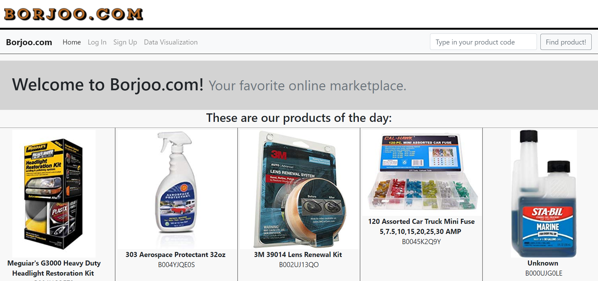
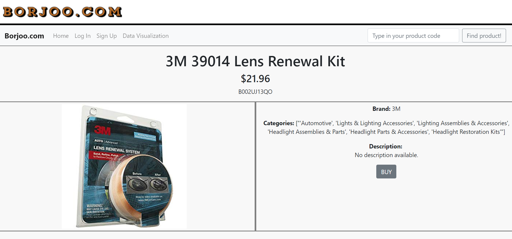
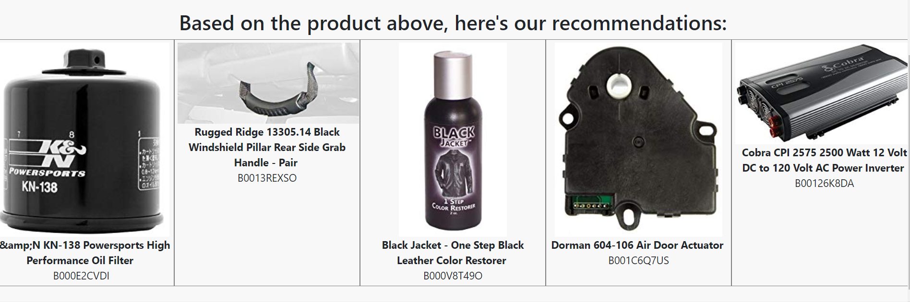
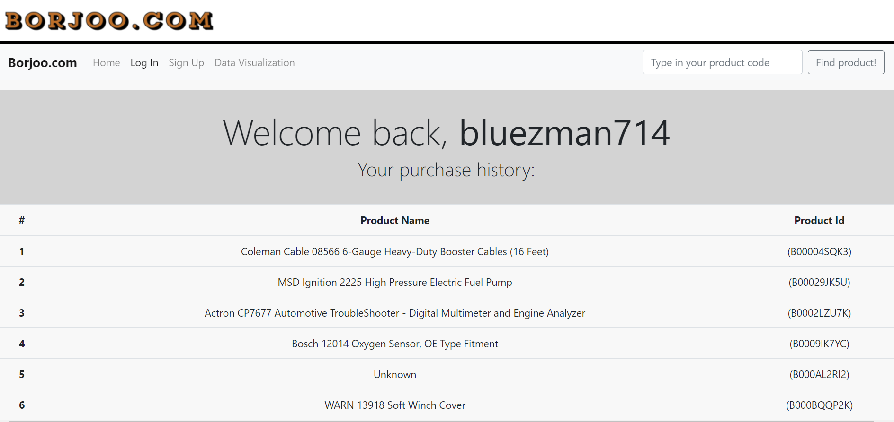
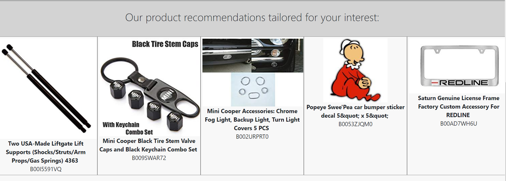
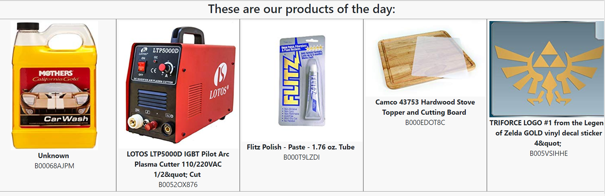
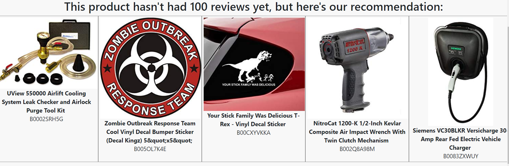

# Flask based Simple Online Marketplace Website, added with Product Recommender System Machine Learning using Sci-Kit Learn
## Final Project for Purwadhika Startup and Coding School - Job Connector Data Science Batch 04

This project is about a simple online marketplace website. Highlight in this project is the product recommender system, using collaborative filtering method (both product and user based). 
I'm mixing both textual reviews for each products and their overall average rating. For the sake of ML accuracy:
1. For product based, I select only products which already has more than 100 reviews.
2. For user based, I select only users who already gave more then 20 reviews.

Then I transformed the merged summaries for each products and users using *Count Vectorizer* and find the most similar reviews using K-Nearest Neighbors algorithm from Sci-Kit Learn (also filtered with lowest score boundary).

Data set used: Amazon product data (Category: Automotive). Raw data can be extracted [*here*](http://jmcauley.ucsd.edu/data/amazon/). 

**Citation**
>Ups and downs: Modeling the visual evolution of fashion trends with one-class collaborative filtering; 
R. He, J. McAuley;
WWW, 2016

**How to run the program**
1. Clone this repo.
2. Download clean metadata file [*here*](https://drive.google.com/open?id=1Zs6K43auIMoXd0FXtaSp9BzGDkPQ5sSA). Place it under the same roof with all other files.
3. Run *backend.py*
4. Screenshot of the home page:
    
    There are 3 scenarios for product recommender in this website:

    a. Product based. This will work if you go to the product page (access it by type the product Id in the search box on the top right corner). If the product has already had 100 reviews, the ML will work and will yield the recommendation result. See below:
        
        

    b. User based. This will work if you log in to the website which the username has been listed in the database. Try to sign in with username: *firejackal*, *Dave*, *Chris*, *DeusEx*, or *bluezman714*. See below:
        
        

    c. Content based. On the product page, I also equip the recommendations with 5 other products that have a similar content (3 products with similar sub-category and 2 products with similar brand). See below:
        
    
    d. Popularity based. For other pages, I only used popularity based method (randomly select items where score = 5 from the database). This algorithm designed for the home page and the product page for the product which has below 100 reviews. See below:
        
        
5. Try other features on the website:
    - *Sign Up*
    - *Log In*
    - Dont forget to check out _**Data Visualization**_ page which consists graphics based on: *categories*, *brands*, *score*, and *price*.

### **_Enjoy!_**

#

#### Albertus Rianto Wibisono ✉ _albertusrian95@gmail.com_

[Instagram](https://www.instagram.com/rian__wibisono) | 
[LinkedIn](https://www.linkedin.com/in/albertusrian95/) |
[GitHub](https://www.github.com/RiantoWibisono)
